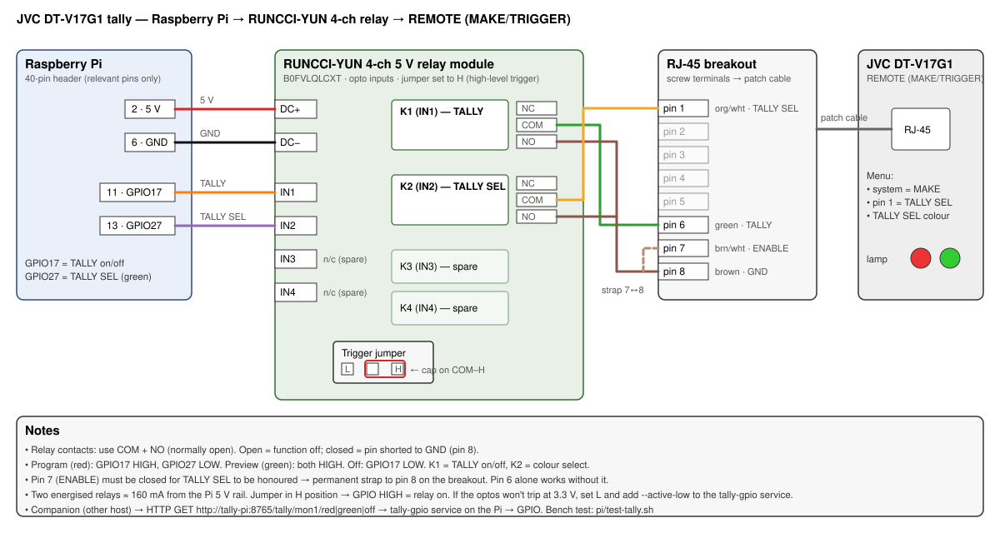

# JVC DT-V17G1 Tally via Companion + Raspberry Pi

Red/green tally on a JVC DT-V17G1 monitor, driven from ATEM program/preview state:

**ATEM → Companion (any host, [jvc-tallypi module](https://github.com/pardeyke/companion-module-jvc-tallypi)) → HTTP → Raspberry Pi → relays → JVC REMOTE port**

This repo holds the hardware documentation and the Pi-side `tally-gpio` HTTP
service. The Companion module (with built‑in ATEM‑follow — no triggers needed)
lives in [pardeyke/companion-module-jvc-tallypi](https://github.com/pardeyke/companion-module-jvc-tallypi);
grab the `.tgz` from its Releases page and use *Modules → Import custom module*.

## Wiring



Board: **RUNCCI‑YUN 4‑channel 5 V relay module**
([B0FVLQLCXT](https://www.amazon.de/dp/B0FVLQLCXT)) — opto‑isolated inputs, true
dry contacts, **trigger jumper on H** (GPIO HIGH = relay closed).

| Pi header | → | Relay board |
|-----------|---|-------------|
| phys 2 · 5 V | → | DC+ |
| phys 6 · GND | → | DC− |
| phys 11 · GPIO17 | → | IN1 (TALLY) |
| phys 13 · GPIO27 | → | IN2 (TALLY SEL) |

| Relay contact | → | RJ‑45 (T568B color) | JVC function |
|---------------|---|---------------------|--------------|
| K1 COM / NO | → | pin 6 (green) / pin 8 (brown) | TALLY on/off |
| K2 COM / NO | → | pin 1 (orange‑white) / pin 8 (brown) | TALLY SEL (green lamp) |
| strap | | pin 7 (brown‑white) ↔ pin 8 (brown) | ENABLE — required for TALLY SEL |

Use **NO**, not NC. IN3/IN4 = spare for a second monitor (BCM 22/23).
Truth table: program (red) = GPIO17 HIGH; preview (green) = 17+27 HIGH; off = 17 LOW.

### Monitor side (REMOTE = MAKE/TRIGGER RJ‑45, contact closure to GND)

- Menu (REMOTE SETTING): set **PARALLEL TYPE = SET** to assign **TALLY SEL to
  pin 1**, then **switch PARALLEL TYPE back to MAKE** — in SET the assignments are
  edited but external control is not active (only the special-cased TALLY pin 6
  keeps working, which is misleading). TRIGGER pulse-toggles; don't use it.
  **TALLY SEL is an edge-triggered toggle** (measured on hardware): each
  closure flips red↔green and the monitor latches the colour. The Pi service
  therefore tracks the latched colour and pulses the SEL relay only when the
  colour must change; the tracked colour persists across service restarts.
  If tracker and lamp ever disagree (fresh monitor, manual toggling), sync once
  via `/calibrate/mon1/red|green` or the module's *Calibrate lamp colour* action.
- Pin 6→8 closed = lamp on; TALLY SEL pin closed = green instead of red.
- **Pin 7 (ENABLE) must be closed for TALLY SEL to work** (verified on hardware;
  the manual only exempts pin 6). Hence the permanent 7↔8 strap.
- With ENABLE strapped, all assigned remote pins are honored — leave pins 2–5
  unassigned in the menu.

Avoid the cheap "PC817 4‑Kanal Optokoppler" boards (3.6 V minimum input, in/out
grounds tied on the PCB, coupled pull‑ups) and "12V→3.3V PLC" converters (wrong
direction). Bare PC817s + 330 Ω on the GPIOs work if you'd rather solder.

## Raspberry Pi setup

Any Pi with network is enough (tested target: Pi 3 Model B). Flash **Raspberry Pi
OS Lite (64‑bit)** with Raspberry Pi Imager (hostname `tally-pi`, SSH on, user
set), give it a fixed IP/DHCP reservation, then:

```bash
scp -r pi <user>@tally-pi.local:
ssh <user>@tally-pi.local
sudo apt update && sudo apt full-upgrade -y
cd pi && sudo ./install.sh     # python3-gpiozero + systemd service on :8765
```

`pi/tally_gpio.py` is a small HTTP→GPIO service (gpiozero, works on Pi 3–5 /
Bookworm). It forces relays off at start/stop and restarts automatically.

- API: `/tally/<mon>/off|red|green` · `/calibrate/<mon>/red|green` · `/pin/<bcm>/0|1` · `/state` · `/health` (GET or POST)
- Monitors/pins: edit `ExecStart` in `/etc/systemd/system/tally-gpio.service` —
  e.g. add `--monitor mon2=22,23`; `--active-low` if the relay jumper is on L;
  `--sel-mode level` for monitors whose colour pin is level-based (default: toggle).

Bench test without Companion: `./pi/test-tally.sh` (red → green → off via pinctrl),
or from any host:

```bash
curl http://tally-pi.local:8765/tally/mon1/red
```

## Companion setup

Install the **[jvc-tallypi module](https://github.com/pardeyke/companion-module-jvc-tallypi)**
(Releases → `.tgz` → *Modules → Import custom module*, Companion ≥ 4), add the
connection, and configure:

- **Pi host/IP** + port 8765
- **ATEM IP** → enables ATEM‑follow
- **Mappings** (up to 4): monitor name / ATEM Output (aux) # / M/E #
  — e.g. `mon1` / Output 10 / M/E 4

That's all: the module connects to the ATEM itself and computes
*output source == M/E program → red, == preview → green, else off* on every
state change — no triggers, survives output re-routing, re-pushes state if the
Pi restarts. It also provides manual actions, tally feedbacks, variables, and
red/green/off presets.

<details>
<summary>Fallback without the module: Generic HTTP + 3 triggers</summary>

Add a **Generic: HTTP Requests** connection (base URL `http://<pi-ip>:8765`) and
three triggers comparing ATEM variables (no per-camera triggers needed; names
per the bmd-atem *Variables* tab):

| Trigger | Condition (*Check boolean expression*) | Action (GET) |
|---------|----------------------------------------|--------------|
| Red   | `$(atem:aux10_input_id) == $(atem:pgm4_input_id)` | `/tally/mon1/red` |
| Green | `== pvw4 && != pgm4` | `/tally/mon1/green` |
| Off   | `!= pgm4 && != pvw4` | `/tally/mon1/off` |

</details>

## References

- [JVC DT-V17G1 manual, pp. 20–21](https://www.manualslib.com/manual/81840/Jvc-Dt-V17g1.html?page=20) — MAKE/TRIGGER pin assignment
- [Companion module: jvc-tallypi](https://github.com/pardeyke/companion-module-jvc-tallypi)
- Full-size diagram: [wiring.svg](wiring.svg) / [wiring.png](wiring.png)

## Bill of materials

| Item | Notes |
|------|-------|
| Raspberry Pi + PSU + microSD ≥8 GB | any networked Pi (here: 3 Model B, Ethernet recommended) |
| RUNCCI-YUN 4-ch 5 V relay module ([B0FVLQLCXT](https://www.amazon.de/dp/B0FVLQLCXT)) | jumper on H |
| RJ-45 breakout board (jack → screw terminals) | lands pins 1/6/7/8 |
| Cat5/6 patch cable | breakout → monitor REMOTE |
| Dupont wires (F-F) + hook-up wire | Pi → relay board, board → breakout |
| Small enclosure (optional) | behind-monitor tidiness |
